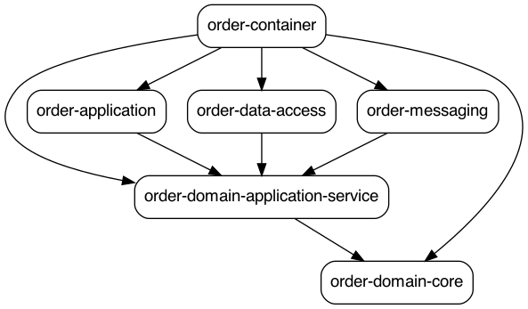

# 602-Udemy---Microservices-Clean-Architecture-DDD-SAGA-Outbox-Kafka-2022-5


Apply "depgraph-maven-plugin":

- install tool:
```
brew install graphviz
```

- Run maven command line:
```
mvn com.github.ferstl:depgraph-maven-plugin:3.0.1:aggregate -DcreateImage=true -DreduceEdges=false -Dscope=compile "-Dincludes=com.food.ordering.system*:*"
```


